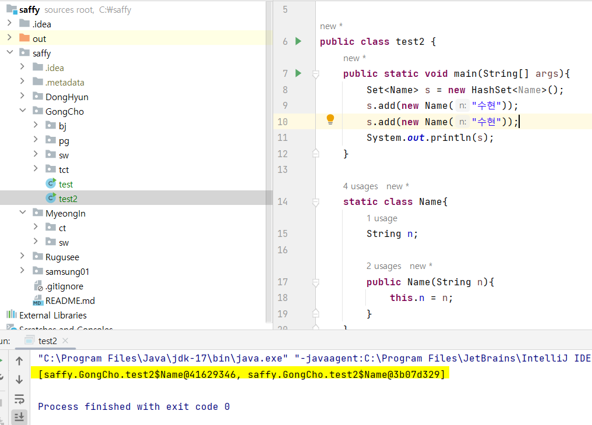

## HashSet 중복여부 판별 재정의



- 위 두 객체는 주솟값이 다르기때문에 중복여부에서 판별되지 않고있다.

Name의 n필드가 서로 같다면 중복이 되도록 해주고 싶다!

그러기 위해서는 equals()와 hashCode()를 재정의한다.

아래는 실제로 자동차 이름이 같은 경우 중복여부를 판별하도록 하기 위해 재정의한 코드이다.

(자동차 경주[2차] 때 적용함.)

```jsx
public class Cars {
    private final List<Car> cars;
```

```jsx
private void validateDuplicateCarName() {
    int uniqueCarCount = new HashSet<>(cars).size();
    if (cars.size() != uniqueCarCount) {
        throw new DuplicateException(DUPLICATE_MESSAGE.getValue());
    }
}
```

```jsx
@Override public boolean equals(Object diffCarName) {
    if (this == diffCarName) return true;
    if (diffCarName == null || getClass() != diffCarName.getClass()) return false;
    Name carName = (Name) diffCarName;
    return Objects.equals(name, carName.name);
}

@Override public int hashCode() {
    return Objects.hash(name);
}
```

```jsx
@Override public boolean equals(Object diffCars) {
    if (this == diffCars) return true;
    if (diffCars == null || getClass() != diffCars.getClass()) return false;
    Cars cars = (Cars) diffCars;
    return Objects.equals(this.cars, cars.cars);
}

@Override public int hashCode() {
    return Objects.hash(cars);
}
```

Car클래스에 Equals()와 hashCode()를 재정의해준 이유는, 아래 두 객체가 같도록 해주기 위함.

```jsx
Car car1 = new Car("Car1");
Car car2 = new Car("Car1");
// car1.equals(car2)는 true를 반환합니다.
```

Cars클래스에 Equals()와 hashCode()를 재정의해준 이유는, 아래 두 객체가 같도록 해주기 위함.

```jsx
Cars cars1 = Cars.create("Car1,Car2,Car3", new NumberGenerator());
Cars cars2 = Cars.create("Car1,Car2,Car3", new NumberGenerator());
// cars1.equals(cars2)는 true를 반환합니다.
```
