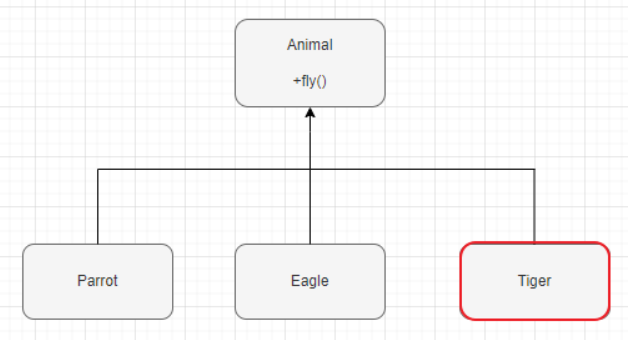
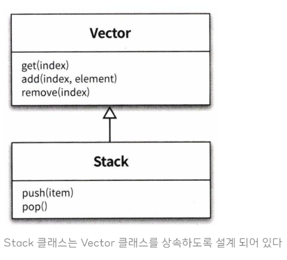

## 상속을 자제하고 합성을 이용하자

### 결론 : 상속을 이용하면 결합도가 높아지기 때문에 합성을 권장하고 있다.

상속은 명확한 is - a 관계에 있는 경우, 그리고상위 클래스가 확장할 목적으로 설게되었고 문서화도 잘되어 있는 경우에 사용하면 좋다.

하지만, 아래와 같은 이유로 **현업에서 상속을 지양하고 있다.**

### 1. 결합도가 높아진다.

- 결합도 : 하나의 모듈이 다른 모듈에 대해 얼마나 많은 지식을 갖고 있는지를 나타내는 의존 정도를 뜻한다.

객체지향 프로그래밍에서는 결합도는 낮을수록, 응집도는 높을수록 좋다. 그래서 추상화에 의존함으로써 다른 객체에 대한 결합도는 최소화하고 응집도를 최대화하여 변경 가능성을 최소화 할 수 있다.

### 2. 불필요한 기능 상속

부모 클래스에 메소드를 추가했을때, 자식 클래스에는 적합하지 않는 메소드가 상속되는 문제이다.예를 들어서 아래 그림과 같이 Animal 클래스에 fly() 라는 메소드를 추가했을때, Tiger 자식 클래스에서는 동작하지 않는 메소드가 되어 버린다.물론 메소드를 구현하고 빈칸으로 놔두거나, 클래스를 분리하고 분리하여 해결은 할 수 있지만 결국 복잡해질 뿐이다.



### 3. 부모클래스의 결함이 그대로 넘어옴

### 4. 부모클래스와 자식클래스의 동시 수정 문제

말 그대로 부모 클래스와 자식 클래스 사이의 개념적인 결합으로 인해, 부모 클래스를 변경할 때 자식 클래스도 함께 변경해야 하는 문제를 말한다.

### 5. 메소드 오버라이딩의 오동작

자식 클래스가 부모 클래스의 메서드를 오버라이딩할 때 자식 클래스가 부모 클래스의 메서드 호출 방법에 영향을 받는 문제이다. 이는 캡슐화를 위반한 것과 같다.

캡슐화 : 객체가 내부적으로 기능을 어떻게 구현하는지를 감추는 것을 말한다.

### 6. 불필요한 인터페이스 상속문제

부모 클래스에서 상속받은 메서드를 사용할 경우 자식 클래스의 규칙이 위반 될 수 있다는 것이다.

예를 들어 Stack의 대표적인 동작은push,pop 이지만, 상속한 Vector 클래스의add 메소드 또한 외부로 노출되게 된다. 그러면서 아래와 같이 개발자가add 메소드도 스택 클래스에서 사용할수 있는 메소드인줄 알고 사용했다가, 의도치 않은 동작이 실행되면서 오류를 범하게 된다.



```java
Stack<String> stack = new Stack<>();
stack.push("one");
stack.push("two");
stack.push("three");

stack.add(0, "four"); // add 메소드를 호출함으로써 stack의 의미와는 다르게 특정 인덱스의 값이 추가

String str = stack.pop(); // three
System.out.println(str.equals("four")); // false
```

### 상속 대신 합성을 사용하자!

### 합성이란?

합성(Composition)은 또다른 말로조합이나 그냥 콩글리쉬로 컴포지션이라고 불린다.합성 기법은 기존 클래스를 상속을 통한 확장하는 대신에,필드로 클래스의 인스턴스를 참조하게 만드는 설계이다.예를들어 서로 관련없는 이질적인 클래스의 관계에서, 한 클래스가 다른 클래스의 기능을 사용하여 구현해야 한다면합성의 방식을 사용한다고 보면 된다.가령 학생(Student)과 학생이 수강하는 과목(Subject)을 의미한다.

```
public class Stack<E> {
private Vector<E> elements = new Vector<>(); // 합성사용

	public E push(E item) {
	    elements.addElement(item);
	    return item;
	}

	public E pop() {
	    if (elements.isEmpty()) {
	        throw new EmptyStackException();
	    }
	    return elements.remove(elements.size() -1);
	}

}
```

- 참조 블로그 : [https://inpa.tistory.com/entry/OOP-💠-객체-지향의-상속-문제점과-합성Composition-이해하기](https://inpa.tistory.com/entry/OOP-%F0%9F%92%A0-%EA%B0%9D%EC%B2%B4-%EC%A7%80%ED%96%A5%EC%9D%98-%EC%83%81%EC%86%8D-%EB%AC%B8%EC%A0%9C%EC%A0%90%EA%B3%BC-%ED%95%A9%EC%84%B1Composition-%EC%9D%B4%ED%95%B4%ED%95%98%EA%B8%B0)
