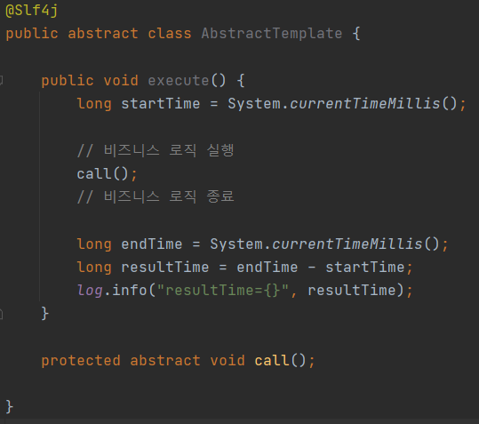
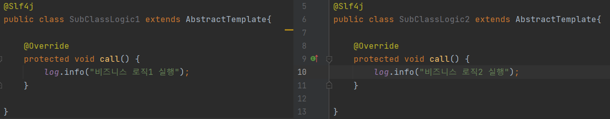
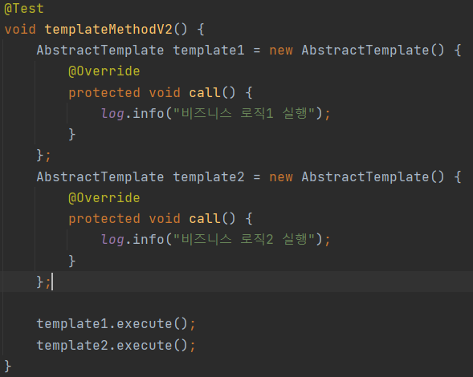
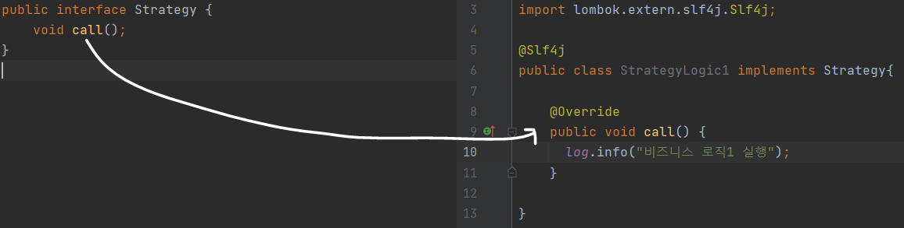
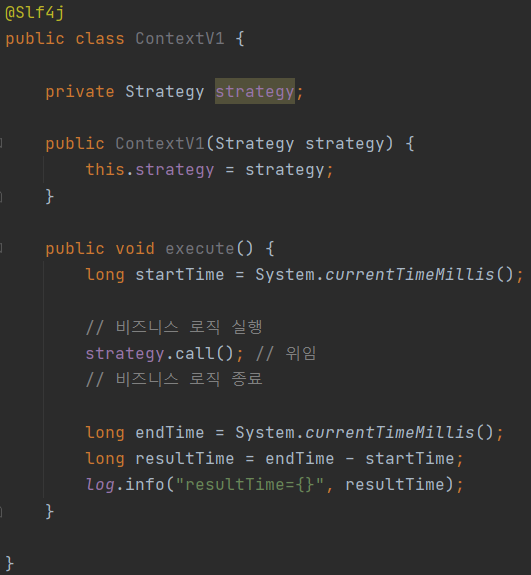
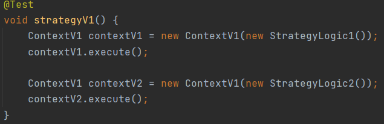
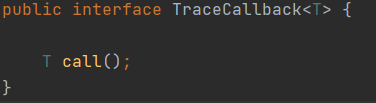
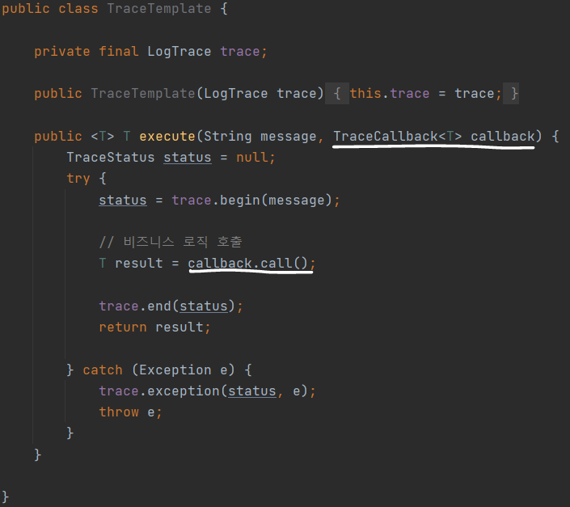
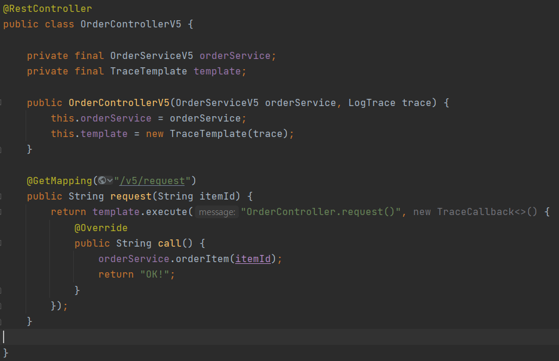

### 1. 템플릿 메소드 패턴

변하는 부분과 변하지 않는 부분을 분리하기 위한 것으로, **템플릿**이라는 틀에 **변하지 않는 부분**을 몰아두고 **변하는 부분**을 **별도로 Override하여 호출**하는 식으로 해결한다.

익명 내부 클래스를 이용하여 템플릿 메소드 패턴을 사용해볼 수 있다.

매번 추상 클래스를 상속받는 자식 클래스를 생성하는 번거로움을 해결할 수 있다.

### 2. 전략패턴

전략 패턴은 변하지 않는 부분을 **Context** 라는 곳에 두고 변하는 부분을 **Strategy**라는 인터페이스를 만들어 이를 구현하도록 하여 문제를 해결한다. 즉, 상속이 아닌 **위임**으로 문제를 해결한다.

인터페이스를 만들어 메소드를 위임받도록 하였지만, 사용할 때마다 어떤 함수(어떤 전략)를 사용할 것인지 정해줘야한다. 그래서 나온 것이 템플릿 콜백 패턴이다.

### 3. 템플릿 콜백 패턴

다른 코드의 인수로써 넘겨주는 실행 가능한 코드를 **Callback이라고 한다.**

TraceTemplate 인스턴스의 execute()가 실행될 때 Callback 인터페이스의 구현체를 넘겨받아 그 구현체의 call()을 호출한다.

- 참조 블로그 : https://minchul-son.tistory.com/540
